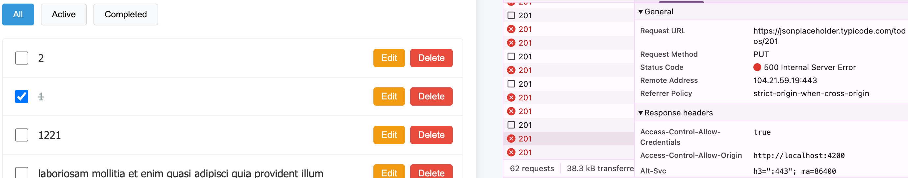
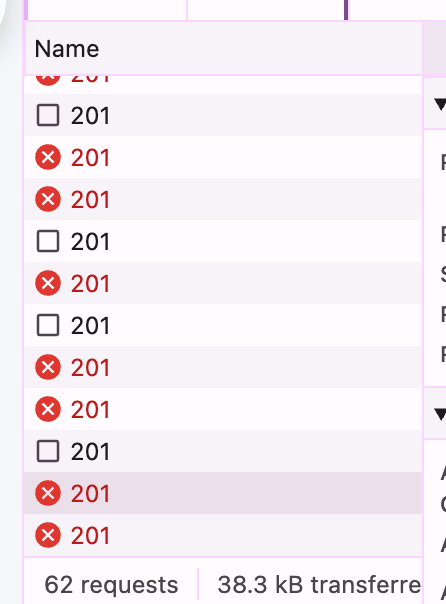
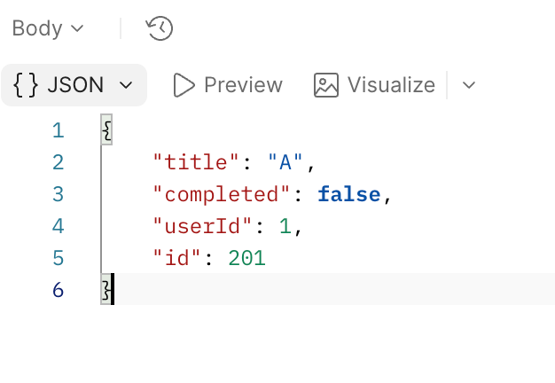
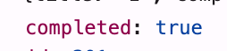
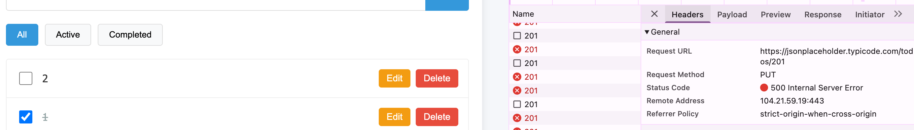

# Баг-репорты

<div class="suite-summary" markdown>

**3 баг-репорта · 3 Critical**

Обновление новой задачи · одинаковые идентификаторы · откат статуса

</div>

!!! info "Статус материалов"
    Ниже оформлены наблюдения из предоставленного текста. В рамках подготовки этой документации дефекты не воспроизводились; ко всем трём баг-репортам приложены предоставленные скриншоты. Исходный код приложения не предоставлен.

<div class="test-case bug-report" markdown>

## BUG-001 · PUT новой таски возвращает 500, Edit и Complete не работают

<div class="case-tags"><span class="case-tag negative">Severity: Critical</span><span class="case-tag">Chrome · macOS</span><span class="case-tag neutral">PUT /todos/201</span></div>

### Окружение

Google Chrome, macOS, `localhost:4200`

### Предусловие

Приложение открыто, API JSONPlaceholder доступен.

### Шаги воспроизведения

1. Создать новую задачу, например с `title = "Test task"`.
2. Убедиться, что `POST /todos` завершился успешно и в response получен новый id таски.
3. Кликнуть Edit у созданной задачи → изменить title → Save.
4. Проверить Network / Console.

<div class="result-panel actual" markdown>

### Фактический результат

- Отправляется `PUT /todos/{id новой таски}`;
- сервер возвращает `HTTP 500 Internal Server Error`;
- изменение title не сохраняется корректно;
- аналогичная ошибка возникает при изменении completed у созданной задачи;
- в Console отображается `HttpErrorResponse`;
- response имеет `Content-Type: text/html; charset=utf-8`, а не структурированный JSON error response.

</div>

### Дополнительные данные

```yaml
access-control-allow-origin: http://localhost:4200
x-ratelimit-remaining: 995
x-powered-by: Express
```

**Вывод:** запрос доходит до backend, ошибка не связана с CORS или rate limit и возникает при серверной обработке `PUT /todos/201`.

<div class="result-panel expected" markdown>

### Ожидаемый результат

- Созданная задача должна поддерживать последующий Update;
- `PUT /todos/{id}` должен завершаться успешным ответом;
- обновлённые данные должны применяться к выбранной таске;
- при ошибке API пользователь должен получить корректное состояние ошибки.

</div>

### Вложения

<figure class="bug-attachment" markdown>

[](assets/images/bug-001-put-500.png){ target="_blank" rel="noopener" }

<figcaption>BUG-001 · Ошибка PUT /todos/201 в Network<br>Нажмите на скриншот, чтобы открыть в полном размере.</figcaption>
</figure>

</div>

<div class="test-case bug-report" markdown>

## BUG-002 · POST /todos возвращает одинаковый `id=201` для разных созданных задач

<div class="case-tags"><span class="case-tag negative">Severity: Critical</span><span class="case-tag">Chrome · macOS</span><span class="case-tag neutral">POST /todos · id=201</span></div>

### Окружение

Google Chrome, macOS, `localhost:4200`

### Предусловие

Приложение открыто, JSONPlaceholder доступен.

### Шаги воспроизведения

1. Создать задачу с `title = "Task A"`.
2. Проверить response `POST /todos` → сохранить полученный `id`.
3. Создать задачу с `title = "Task B"` → проверить response `POST /todos`.
4. Сравнить `id` созданных задач.
5. Попробовать изменить `title` или `completed` одной из них.

<div class="result-panel actual" markdown>

### Фактический результат

- Обе разные задачи получают одинаковый `id = 201`;
- frontend хранит несколько различных объектов с одинаковым идентификатором;
- последующие Edit / Complete / Delete определяют задачу по `id`, поэтому операция не может однозначно определить нужный объект.

</div>

<div class="result-panel expected" markdown>

### Ожидаемый результат

- Каждая отдельная таска на клиенте должна иметь уникальный id;
- Update/Delete должны однозначно применяться только к выбранной таске.

</div>

### Вложения

<div class="attachment-gallery" markdown>

<figure class="bug-attachment" markdown>

[](assets/images/bug-002-network-201.png){ target="_blank" rel="noopener" }

<figcaption><strong>01 · Network</strong><br>Запросы к ресурсу с идентификатором 201.</figcaption>
</figure>

<figure class="bug-attachment" markdown>

[](assets/images/bug-002-response-201.png){ target="_blank" rel="noopener" }

<figcaption><strong>02 · Response</strong><br>Объект задачи с <code>id: 201</code>.</figcaption>
</figure>

</div>

<p class="attachment-hint">Нажмите на любой скриншот, чтобы открыть его в полном размере.</p>

</div>

<div class="test-case bug-report" markdown>

## BUG-003 · UI изменяет completed до успешного PUT и не откатывает состояние при ошибке

<div class="case-tags"><span class="case-tag negative">Severity: Critical</span><span class="case-tag">Chrome · macOS</span><span class="case-tag neutral">completed · PUT · HTTP 500</span></div>

### Окружение

Google Chrome, macOS, `localhost:4200`

### Шаги воспроизведения

1. Открыть Active → установить checkbox у таски.
2. Проверить `PUT /todos/{id}`.
3. После HTTP 500 переключиться между Active, Completed и All.

<div class="result-panel actual" markdown>

### Фактический результат

- Поле completed изменяется локально до получения успешного ответа API;
- PUT завершается HTTP 500;
- UI может показывать задачу как Completed, несмотря на неуспешный Update;
- задача может некорректно переходить между фильтрами;
- сообщение об ошибке пользователю отсутствует.

</div>

<div class="result-panel expected" markdown>

### Ожидаемый результат

- Изменение статуса должно считаться сохранённым только после успешного ответа API;
- при ошибке PUT предыдущее значение completed должно быть восстановлено либо явно показана ошибка;
- задача должна оставаться в фильтре, соответствующем фактически сохранённому состоянию.

</div>

### Вложения

<figure class="bug-attachment attachment-detail" markdown>

[](assets/images/bug-003-completed-true.png){ target="_blank" rel="noopener" }

<figcaption><strong>01 · Значение completed</strong><br>В предоставленном фрагменте данных — <code>completed: true</code>.</figcaption>
</figure>

<figure class="bug-attachment" markdown>

[](assets/images/bug-003-ui-put-500.png){ target="_blank" rel="noopener" }

<figcaption><strong>02 · UI и Network</strong><br>Задача отмечена выполненной, при этом PUT /todos/201 возвращает HTTP 500.</figcaption>
</figure>

<p class="attachment-hint">Нажмите на любой скриншот, чтобы открыть его в полном размере.</p>

</div>
